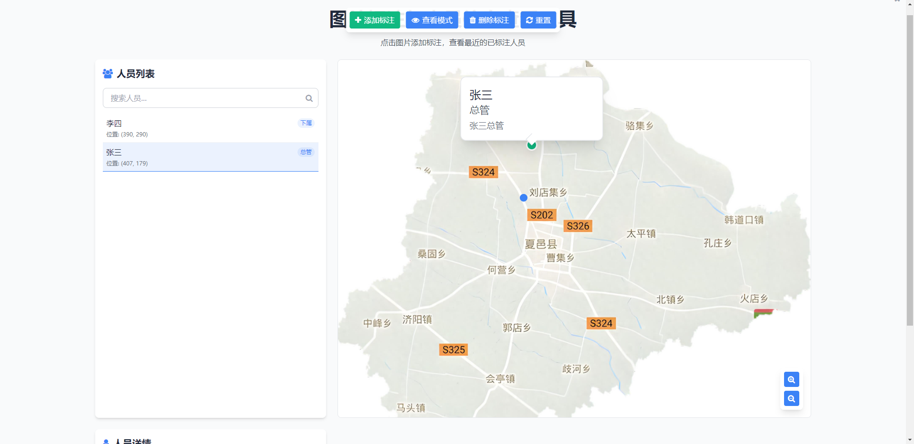

# 图片标注与人员信息查看工具

这是一个功能强大的图片标注应用程序，允许用户在图片上标记人员位置并查看相关信息。通过直观的界面，用户可以轻松添加、管理和查看人员标注，支持图片缩放和平移操作，以及搜索和过滤功能。

## 功能特点

- **标注功能**：在图片上任意位置添加人员标注，设置姓名、角色和描述信息
- **查看模式**：点击图片查看最近的已标注人员，支持拖拽和缩放地图
- **删除功能**：轻松删除不需要的标注点
- **人员列表**：左侧面板展示所有标注人员，支持搜索筛选
- **详情面板**：右侧显示选中人员的详细信息和附近的其他人员
- **本地存储**：所有标注数据保存在本地浏览器中，刷新页面不会丢失
- **响应式设计**：适配不同屏幕尺寸，在移动设备上自动调整布局

## 使用方法

1. **添加标注**：选择"添加标注"模式，然后点击图片上的任意位置，在弹出的表单中填写人员信息
2. **查看标注**：选择"查看模式"，点击图片查看最近的标注点，或从左侧列表中选择人员
3. **删除标注**：选择"删除标注"模式，点击要删除的标注点
4. **缩放和平移**：使用右下角的缩放控制按钮，或在"查看模式"下双击图片进行缩放，按住鼠标拖动图片进行平移
5. **搜索人员**：在左侧搜索框中输入关键词，快速筛选人员

## 技术实现

- 前端框架：纯HTML/CSS/JavaScript，使用Tailwind CSS v3进行样式设计
- 状态管理：使用原生JavaScript对象进行状态管理
- 本地存储：使用localStorage保存标注数据
- 交互效果：使用CSS动画和过渡效果增强用户体验

## 部署说明

这个应用程序是纯前端实现，无需后端支持。您可以通过以下方式部署：

1. 将所有文件复制到您的Web服务器目录中
2. 确保您的服务器配置允许访问这些文件
3. 通过浏览器访问HTML文件即可使用

## 截图

## 贡献指南

如果您想为这个项目做出贡献，请遵循以下步骤：

1. Fork这个仓库
2. 创建您的特性分支 (`git checkout -b feature/YourFeature`)
3. 提交您的更改 (`git commit -am 'Add some feature'`)
4. 将您的分支推送到远程仓库 (`git push origin feature/YourFeature`)
5. 提交Pull Request

## 许可证

本项目采用MIT许可证。有关详细信息，请参阅LICENSE文件。
